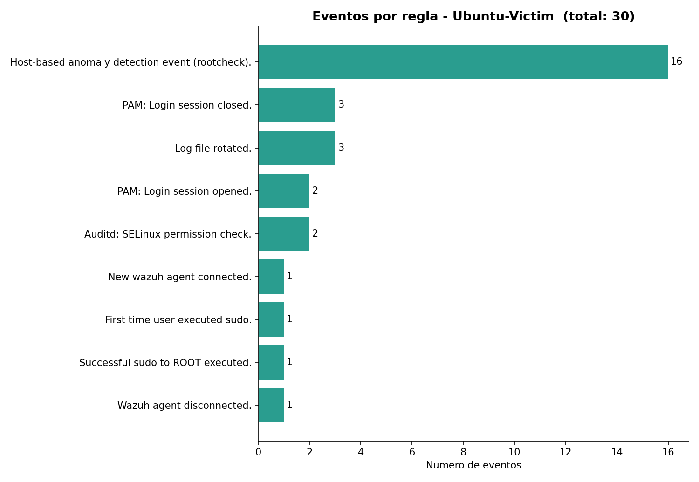
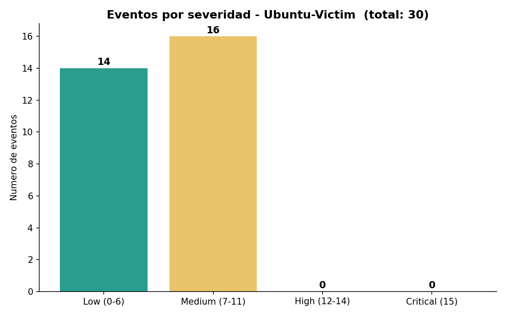

# Día 1 — Baseline del entorno

**Fecha:** 2026-07-03
**Fase:** 1 — Fundamentos y visibilidad

## Objetivo

Identificar qué alertas corresponden al funcionamiento normal del sistema y de Wazuh, para tener un baseline de referencia antes de generar ataques.

## Entorno

- Wazuh 4.14.6 (Docker single-node: indexer + manager + dashboard).
- Agentes: `Ubuntu-Victim` (Ubuntu 25.10) y `MacBook-M1` (macOS, Apple Silicon). Ambos Active.

## Consulta

Módulo Threat Hunting → Events, filtrando por endpoint con DQL:

```
agent.name: "Ubuntu-Victim"
```

30 eventos en 24 h. Todos entre nivel 3 y 7; ninguno alto (12–14) ni crítico (15).

## Eventos observados

| Nº | rule.id | Nivel | Descripción |
|---|---|---|---|
| 16 | 510 | 7 | Host-based anomaly detection (rootcheck) |
| 3 | 591 | 3 | Log file rotated |
| 3 | 5502 | 3 | PAM: Login session closed |
| 2 | 5501 | 3 | PAM: Login session opened |
| 2 | 80730 | 3 | Auditd: SELinux permission check |
| 1 | 5403 | 4 | First time user executed sudo |
| 1 | 5402 | 3 | Successful sudo to ROOT executed |
| 1 | 501 | 3 | New wazuh agent connected |
| 1 | 504 | 3 | Wazuh agent disconnected |

Todo es actividad legítima: escaneos periódicos de rootcheck, rotación de logs, sesiones PAM y `sudo` propias del montaje, y el alta/baja de agentes.

## Gráficos

Eventos por regla:



Eventos por severidad (Low/Medium/High/Critical):



Actividad por hora:


## Triage

Evento benigno / normal (telemetría operacional). No es un incidente: nada de nivel alto/crítico ni grupos ofensivos (`authentication_failed`, `intrusion`). No se escala.

## Notas

- El evento más frecuente, rootcheck (`id 510`), es nivel 7 (medium). O sea que el baseline sí incluye eventos de nivel medio legítimos: "medium" no implica amenaza.
- Los eventos de `sudo` (5402/5403) y de conexión de agente (501) son rastro de la propia sesión de montaje, no de un atacante.

## Lecciones

- Ver muchas alertas no es sinónimo de ataque.
- En triage hay tres opciones, no dos: verdadero positivo, falso positivo y evento benigno/normal.
- Con el baseline conocido (~30 eventos/día, todos rutinarios), lo anómalo resaltará cuando empiecen las pruebas ofensivas.
